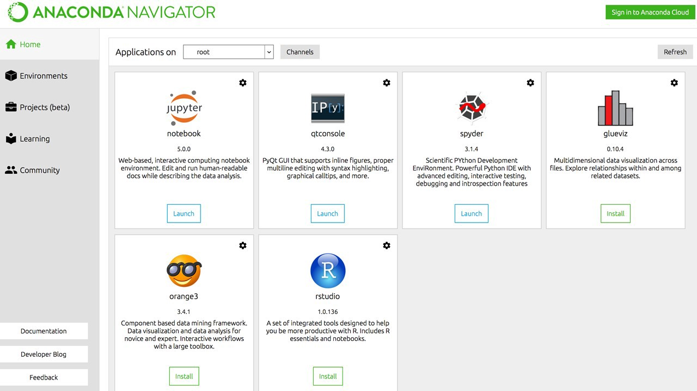

## Setup Windows Environment

If you are on Windows we would need to use Anaconda for setting up a Python environment for development.

1) Download the Anaconda installer https://www.anaconda.com/download/#windows

2) Run the installer, do ensure you are installing Python 3.7

3) Now you can open the Anaconda Navigator command prompt or the GUI version to have a look at your python environment and the dependencies installed. In case you would need to install other things you can use conda/pip install on the command prompt or search for the packages on the Anaconda Navigator GUI.

   
4) It is better to use an IDE for easier development. [VSCode](https://code.visualstudio.com/), [Pycharm](https://www.jetbrains.com/pycharm/) or any other one can be used. 
   
5) The Anaconda Navigator comes handy in managing your environment and you can easily launch IDE instances from here. Anaconda Navigator comes pre-installed with spyder and jupyter notebooks.

6) Also you will need to install a couple of libraries before continuing. Open the anaconda prompt 

And run 
``` 
$ pip install opencv-contrib-python 
$ pip install tensorflow
```

Also just installing tensorflow wont let you use the gpu, you need to install CUDA(for Nvidia) and tensorflow-gpu for using the gpu.
Refer https://www.tensorflow.org/install/gpu for more about this.

#### Use [colab](https://colab.research.google.com/) for now if you really need a GPU as you can get a GPU instance for free.

Refer https://pytorch.org/ on how to install pytorch
